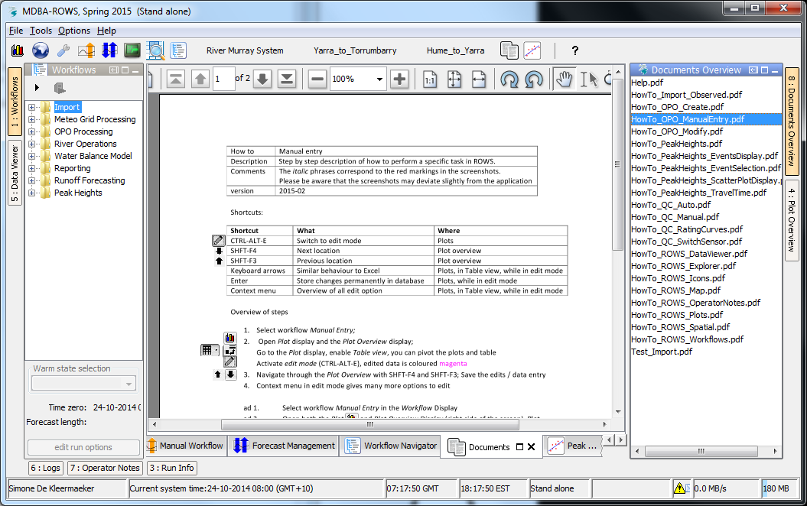

| How To            | Accessing ROWS "How to" help                                        |
| ----------------- | ------------------------------------------------------------------- |
| **Description**   | Step by step description of how to perform a specific task in ROWS. |
| **Software ver.** | 2015.02 and above                                                   |
|||
```
Step by step description of how to perform a specific task in ROWS. The italic phrases correspond to the red markings in the screenshots. Please be aware that the screenshots may deviate slightly from the application
```

The user guide for ROWS is integrated in the user interface by means of the **_`Documents Overview`_** located on the right side of the ROWS explorer. This display contains a list of pdf or html documents that can be opened in the Documents display. The **_`Documents Overview`_** is linked with the **_`Workflows`_** tree on the Explorer window; therefore the Workflows display can be used to filter the list of the Documents.
All documents in the Forecaster Help tree are located in the Documents folder on the local client computer. It is possible to add more documents to this folder and sub-folders; the documents will then automatically be visible in the Documents Overview in the local client.



When selecting an element in the **_`Documents Overview`_**, the selected document will be shown in the Documents display of the Explorer. There is a toolbar in the Documents display to print the selected document or zoom in or out of the document.
